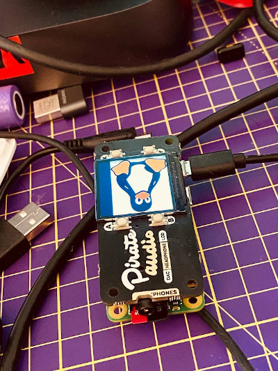

## Pirate Audio Go Module

Go module to control Pimoroni's Pirate Audio LCD and buttons.



## ST7789

The driver package for the 240x240px [Pirate Audio display](https://shop.pimoroni.com/products/pirate-audio-headphone-amp).

Heavily based on the [TinyGo](https://github.com/tinygo-org/drivers/tree/e376785596dc8269f3e8aa42a9bf75fb1457febc/st7789) driver, modified to work with mainline Go, using [periph.io](https://periph.io) to interface with the Raspberry PI (SPI/GPIO).

Also used the [Python driver](https://github.com/pimoroni/st7789-python) by [Philip Howard](https://github.com/Gadgetoid) as a reference.


```Go
package main

import (
	"fmt"
	"image/color"
	"log"
	"os"

	"github.com/rubiojr/go-pirateaudio/st7789"
	"periph.io/x/conn/v3/driver/driverreg"
	"periph.io/x/conn/v3/gpio/gpioreg"
	"periph.io/x/conn/v3/spi"
	"periph.io/x/conn/v3/spi/spireg"
	"periph.io/x/host/v3"
	"periph.io/x/host/v3/bcm283x"
)

func main() {
	if len(os.Args) < 2 {
		fmt.Fprintf(os.Stderr, "Usage: %s \n", os.Args[0])
		os.Exit(1)
	}
	host.Init()

	if _, err := driverreg.Init(); err != nil {
		log.Fatal(err)
	}

	p, err := spireg.Open("SPI0.1")
	if err != nil {
		log.Fatal(err)
	}
	defer p.Close()

	// Raspberry PI broadcom chipset
	fmt.Println(bcm283x.Present())

	// SPI port we're using
	fmt.Println(p.(spi.Port))

	// USE GPIO9 to send data/commands
	// https://pinout.xyz/pinout/pirate_audio_line_out#
	display, err := st7789.NewSPI(p.(spi.Port), gpioreg.ByName("GPIO9"), &st7789.DefaultOpts)
	if err != nil {
		panic(err)
	}

	// Set the screen color to white
	display.FillScreen(color.RGBA{R: 0, G: 0, B: 0, A: 0})

	img, err := os.Open(os.Args[1])
	if err != nil {
		log.Fatal(err)
	}
	defer img.Close()

	// Rotate before pushing pixels, so the image appears rotated
	display.SetRotation(st7789.ROTATION_180)
	display.DrawImage(img)
}
```
